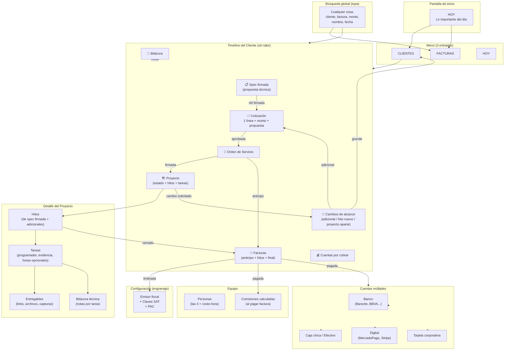

# Sistema Vectoria — Discovery Cerrado

**Fecha:** 2026-08-14
**Agente:** ATLAS M3
**ID:** DISC-20260814-01
**Estado:** Discovery cerrado. Pendientes abajo antes de pasar a INTEGRA.

---

## Diagrama final del sistema (v3, post-ágil)

---

## Módulos y submódulos definitivos

### Estructura del menú (3 entradas)

| Entrada | Qué contiene |
|---|---|
| **Hoy** | Vista de inicio: tareas hoy, CxC vencidas, cotizaciones pendientes, comisiones por pagar |
| **Clientes** | Lista + timeline del cliente (sin tabs) |
| **Facturas** | Lista de facturas + acciones de timbrado/cobro |

### Módulos del sistema (visibles en el timeline del cliente)

| # | Módulo | Función | Estado |
|---|---|---|---|
| 1 | Clientes | CRM ligero con bitácora libre | Diseñado |
| 2 | Levantamiento | Spec libre, versionada, firmada (inmutable) | Diseñado |
| 3 | Cotizaciones | 1 línea (descripción + monto global) + propuesta técnica anexa | Diseñado |
| 4 | Orden de Servicio | Nace de cotización aprobada; firma cliente + agencia | Diseñado |
| 5 | Proyectos | Hitos de spec + tareas con evidencia + horas opcionales + guía del programador | Diseñado, **7 reglas pendientes** |
| 6 | Facturas | Timbrado CFDI 4.0 + estado pago → cuentas + comisiones | Diseñado |
| 7 | Cuentas | Banco / Caja / Digital / Tarjeta (con saldos calculados) | Diseñado |
| 8 | Equipo | 4 personas + costo-hora + comisiones calculadas | Diseñado |
| 9 | Configuración | Emisor fiscal + claves SAT + PAC (engranaje) | Pendiente diseño |
| 10 | Administración/Impuestos | IVA/ISR apartado, categorías egreso, reporte contador | **Pendiente diseño** |

---

## Restricciones críticas (Frank)

1. **Cotización 1 línea, monto global** — sin catálogo de servicios, sin multi-línea, sin desglose de horas.
2. **Servicio único = consultoría de software** — clave SAT principal `80101500` (pendiente confirmar).
3. **Spec firmada es inmutable** — los cambios de alcance se registran como Solicitudes, no editan la spec.
4. **Doble firma en cotización** — se envía como propuesta técnica + cotización en un solo PDF.
5. **Equipo = 4 personas mixtas** (1 programador puro + 1 vendedor puro + 2 mixtos). Sin roles finos ni permisos por usuario.
6. **Sistema ágil: 3 entradas de menú + búsqueda global + timeline del cliente (sin tabs)**.

---

## Decisiones cerradas en discovery (34)

| # | Decisión | Impacto |
|---|---|---|
| 1-7 | Solo 1 línea por cotización (monto global) | Módulo Cotizaciones |
| 8-11 | Propuesta técnica anexa a cotización como PDF combinado (portada + cotización + spec) | Módulo Cotizaciones |
| 12-18 | Reglas de Proyectos (mis sugerencias, **pendientes**) | Módulo Proyectos |
| 19-23 | Cambios de alcance como Solicitudes (Adicional / Hito / Proyecto aparte) | Módulo Proyectos |
| 24-30 | Cuentas múltiples + caja chica con motivos obligatorios | Módulo Cuentas |
| 31-34 | Vista "Hoy" + menú 3 entradas + timeline sin tabs + búsqueda global | UX global |

---

## Pendientes antes de pasar a INTEGRA (fase técnica)

### Bloque A — Reglas de Proyectos (cerrar urgente)

Mis sugerencias para aprobar en bloque:

| # | Regla | Sugerencia |
|---|---|---|
| 12 | Hitos: ¿desde spec o editables? | Desde spec + permitir agregar adicionales |
| 13 | ¿Quién asigna tareas? | Cualquiera de las 4 personas |
| 14 | Tareas: ¿con fecha o solo prioridad? | Solo prioridad |
| 15 | Evidencia para cerrar tarea: ¿obligatoria? | **Sí, obligatoria** (link/archivo/nota) |
| 16 | Cierre de proyecto: ¿auto o sugerido? | Sugerido (botón al cerrar último hito) |
| 17 | Factura por hito cerrado: ¿auto o sugerido? | Sugerido (botón en el hito) |
| 18 | Bitácora de tarea: ¿quién ve? | Las 4 personas |

### Bloque B — Datos de configuración inicial

| # | Pendiente | Sugerencia |
|---|---|---|
| B1 | Clave SAT principal | `80101500` consultoría (o la que indique contador) |
| B2 | Forma de pago PUE vs PPD | Solo PUE al inicio (si se ocupa PPD se agrega después) |
| B3 | Modelo de comisión | % fijo por defecto sobre cotización aprobada |
| B4 | Rentabilidad del proyecto | Horas dedicadas opcionales (sin obligación) |

### Bloque C — Administración / Impuestos (diseñar)

- Apartado de IVA/ISR por periodo
- Egresos categorizados (Nómina, Software, Servicios, Impuestos, Otros)
- Reporte mensual para el contador (XMLs + facturas + egresos)

---

## Hallazgos de discovery

- **Greenfield:** repo `/home/frank/repos/sistema-vectoria` solo contiene `.git/` y `{{PORT}}` (placeholder residual).
- **SPEC previa (INTEGRA):** existe `SPEC-20260814-01.md` propuesta antes del discovery (10 módulos, Next.js+PG+Prisma, stack detallado). **Esta SPEC NO refleja el discovery** — habrá que reescribir o ajustar cuando Frank apruebe pasar a fase técnica.
- **El discovery gana a la SPEC inicial.** Si Frank pasa a fase técnica, INTEGRA debe reescribir la SPEC considerando: 6 módulos visibles + 9 reales, cotización 1 línea, propuesta técnica anexa, cuentas múltiples, sin roles, vista ágil.

---

## Próximo paso para Frank

Responder el **Bloque A** (7 reglas) + **Bloque B** (4 datos) para cerrar discovery. Después decidimos si:
- Opción 1: Diseñar Bloque C (Administración/Impuestos) antes de fase técnica.
- Opción 2: Pasar a INTEGRA con lo que hay (sin Administración) y diseñar después.

Si me das respuesta en bloque a A+B, sigo avanzando.
