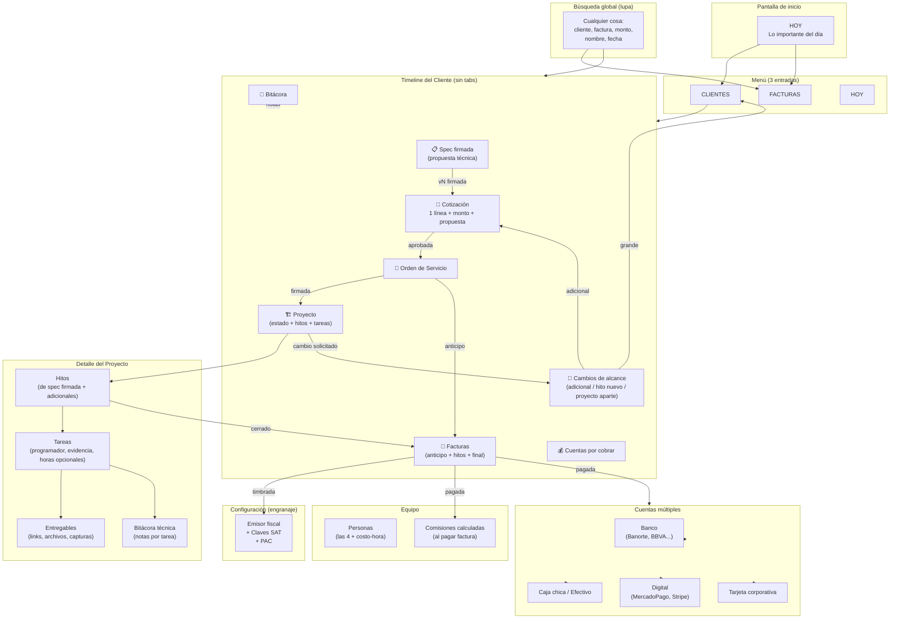

# Sistema Vectoria — Discovery Cerrado

**Fecha:** 2026-08-14
**Agente:** ATLAS M3
**ID:** DISC-20260814-02
**Estado:** Discovery cerrado.

---

## Diagrama (versión final)

---

## Módulos del sistema (8)

| # | Módulo | Función |
|---|---|---|
| 1 | Hoy | Pantalla de inicio con pendientes del día |
| 2 | Clientes | CRM ligero con timeline del cliente |
| 3 | Levantamiento | Spec libre, versionada, firmada |
| 4 | Cotizaciones | 1 línea + propuesta técnica anexa |
| 5 | Orden de Servicio | Entre cotización aprobada y proyecto |
| 6 | Proyectos | Hitos + tareas con evidencia + horas opcionales |
| 7 | Facturas | Timbrado CFDI 4.0 + CxC + tickets para contador |
| 8 | Cuentas | Banco / Caja / Digital / Tarjeta con saldos auto |
| 9 | Equipo | 4 personas + costo-hora + comisiones |

---

## Restricciones críticas (Frank)

1. Cotización 1 línea, monto global (sin catálogo ni multi-línea).
2. Servicio único = consultoría (`80101500`).
3. Spec firmada es inmutable; los cambios van como Solicitudes.
4. Cotización enviada como propuesta técnica + cotización en un solo PDF.
5. Equipo = 4 personas, sin roles finos.
6. UX ágil: Hoy + 2 entradas + búsqueda global + timeline sin tabs.

---

## Decisiones cerradas (40 totales)

| # | Decisión |
|---|---|
| 1-7 | Cotización 1 línea, monto global |
| 8-11 | Propuesta técnica anexa como PDF combinado |
| 12-18 | Reglas de Proyectos (mis sugerencias) |
| 19-23 | Cambios de alcance como Solicitudes |
| 24-30 | Cuentas múltiples + caja chica |
| 31-34 | Vista ágil: Hoy + 3 entradas + búsqueda + timeline |
| 35-36 | Sin módulo de Impuestos — el contador lo hace |
| 37-40 | Tickets de egreso se adjuntan y entregan al contador en ZIP |

---

## Pendientes para cerrar discovery

**Bloque A — 7 reglas de Proyectos**
- Hitos desde spec o editables
- Quién asigna tareas
- Tareas con fecha o solo prioridad
- Evidencia obligatoria o sugerida
- Cierre de proyecto auto o sugerido
- Factura por hito auto o sugerida
- Bitácora de tarea quién ve

**Bloque B — Configuración**
- Clave SAT principal
- PUE vs PPD
- % de comisión (fijo o por persona)
- Rentabilidad (horas opcionales o no medir)
